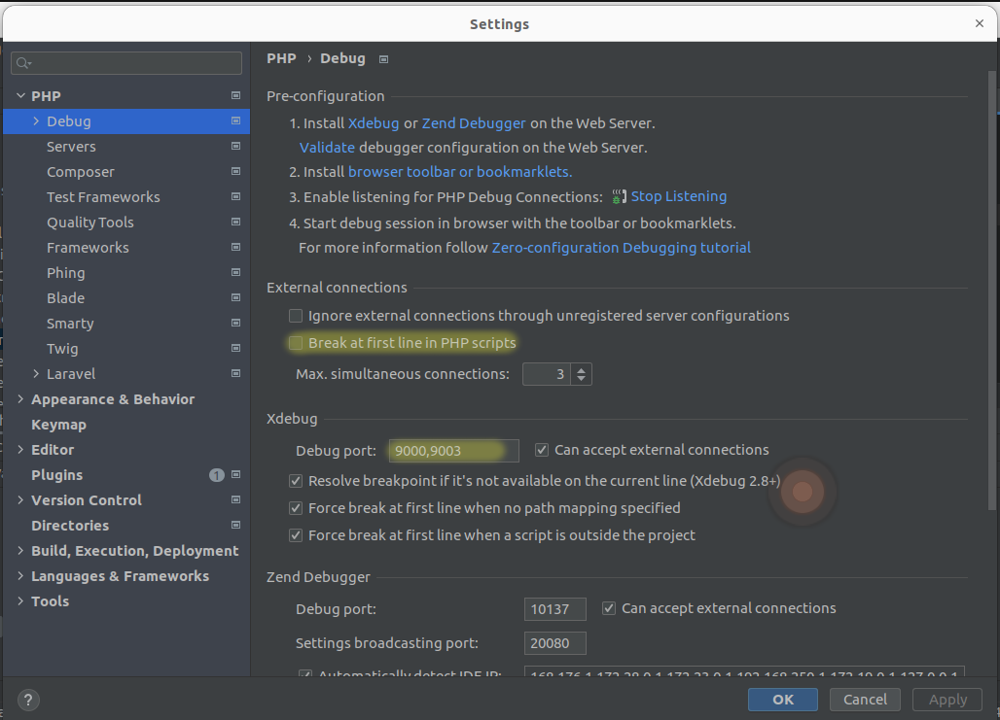
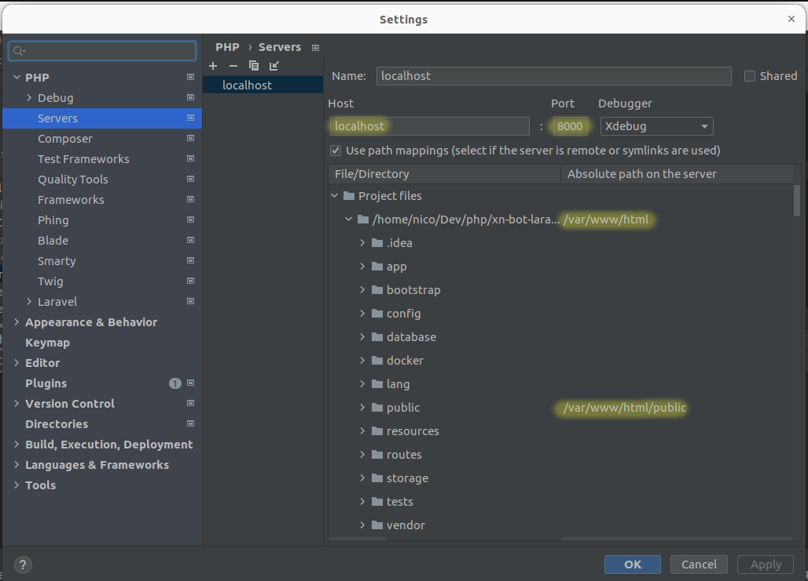
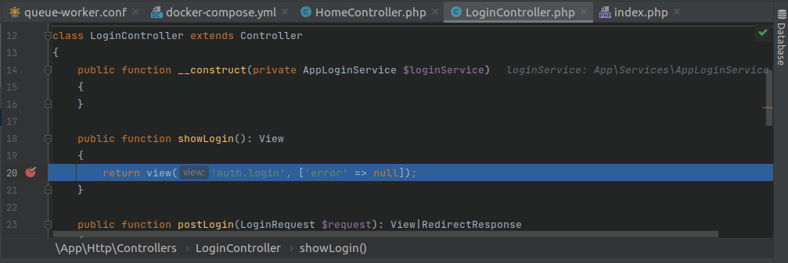

This repository is available at https://github.com/fdbatista/lumen-nginx .

Run stable Lumen/Laravel 9 applications with PHP 8 FPM, Nginx and Supervisor in this alpine-based Docker image.

Specially useful when you don't have enough privileges to install Supervisor.

Example:

- Queue worker configuration on `./docker/supervisor/conf.d/queue-worker.conf`:
```
[program:queue-worker]
command=php /var/www/html/artisan queue:work
process_name=%(program_name)s_%(process_num)02d
numprocs=2
autostart=true
autorestart=true
startsecs=1
startretries=30
user=www-data
redirect_stderr=false
stdout_logfile=/var/log/supervisor/queue-worker.log
stdout_logfile_maxbytes=1MB
stdout_logfile_backups=10
stderr_logfile=/var/log/supervisor/queue-worker-error.log
stderr_logfile_maxbytes=1MB
stderr_logfile_backups=10
```

- Laravel/Lumen service on `docker-compose.yml`:
```
api:
    image: fdbatista/lumen-nginx:2.1
    container_name: api
    restart: always
    env_file:
      - .env
    environment:
      - DB_HOST=${DB_HOST}
      - DB_PORT=${DB_PORT}
      - DB_DATABASE=${DB_DATABASE}
      - DB_USERNAME=${DB_USERNAME}
      - DB_PASSWORD=${DB_PASSWORD}
    volumes:
      - ./:/var/www/html/
      - ./docker/supervisor/conf.d/:/etc/supervisor/conf.d/
    depends_on:
      - db
      - rabbitmq
      - memcached
```

**LOCAL DEVELOPMENT WITH XDEBUG**

For local development, using XDebug might be useful.
The following `Dockerfile` installs and configures it for PHPStorm:
```
FROM fdbatista/lumen-nginx:2.1

RUN  apk add --update linux-headers

RUN apk add --no-cache $PHPIZE_DEPS \
    && pecl install xdebug \
    && docker-php-ext-enable xdebug

COPY docker/php/conf.d/docker-php-ext-xdebug.ini /usr/local/etc/php/conf.d/

RUN chown -R www-data:www-data /var/www/html/

CMD crond && /usr/bin/supervisord -c /etc/supervisor/supervisord.conf
```

Contents of `docker-php-ext-xdebug.ini`:
```
[xdebug]
zend_extension=xdebug.so

xdebug.log=/var/log/xdebug.log
xdebug.mode=debug
xdebug.client_host=host.docker.internal
xdebug.client_port=9003
xdebug.idekey=PHPSTORM
```

The Laravel/Lumen service specification in `docker-compose.yml` needs to be adjusted as follows -note the `build` and `extra_hosts` sections:
```
api:
    build:
      context: .
      dockerfile: Dockerfile
    container_name: api
    extra_hosts:
      host.docker.internal: host-gateway
    restart: always
    env_file:
      - .env
    environment:
      - DB_HOST=${DB_HOST}
      - DB_PORT=${DB_PORT}
      - DB_DATABASE=${DB_DATABASE}
      - DB_USERNAME=${DB_USERNAME}
      - DB_PASSWORD=${DB_PASSWORD}
    volumes:
      - ./:/var/www/html/
      - ./docker/php/supervisor/conf.d/:/etc/supervisor/conf.d/
    depends_on:
      - db
      - rabbitmq
      - memcached
```

**CONFIGURING PHPSTORM**

- Make sure PHPStorm is expecting XDebug connections on port `9003`:
  

- Configure your server to receive connections on `localhost:8000`. Pay attention to the path mappings as well:
  

- Et voilà!:
  
